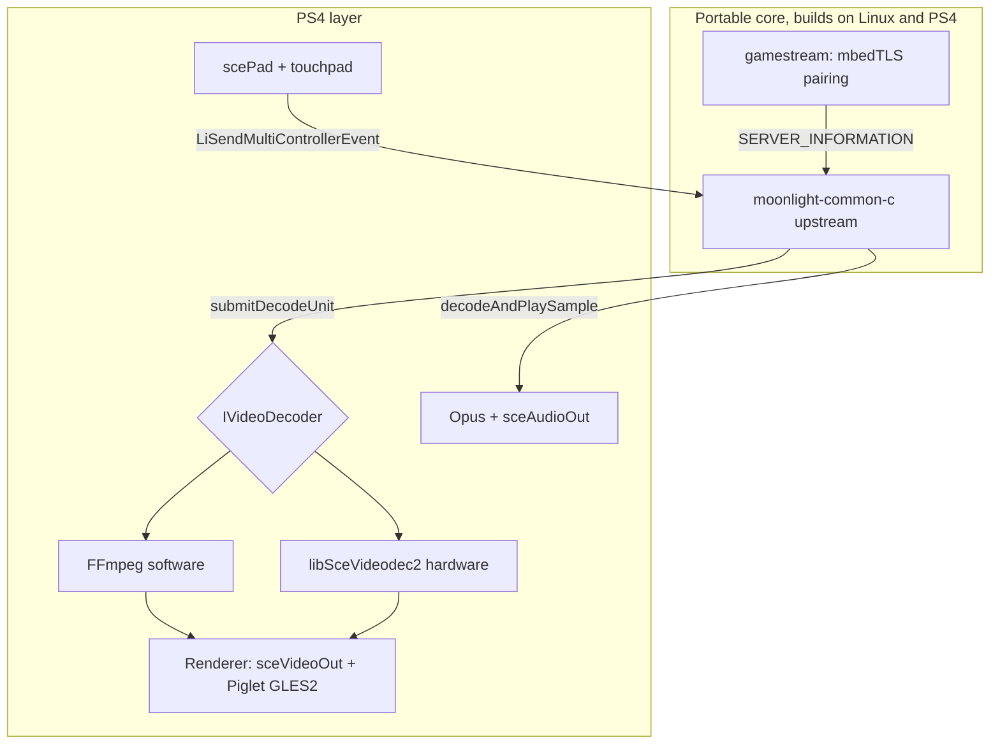

# Moonlight PS4 Port (OpenOrbis, FW 9.00)

Native Moonlight client for jailbroken PS4 (firmware 9.00, GoldHEN), written in C on top of
upstream `moonlight-common-c` and the OpenOrbis toolchain, with the video decoder behind an
abstract interface: FFmpeg software decode to validate the full stack, and `libSceVideodec2`
hardware decode as the stretch goal.

**Current version: 1.0.4** (as of 2026-08-02).

## Realistic goal

**1440p120 is not possible.** The PS4 Slim has HDMI 1.4 and the OS only exposes 480p/720p/1080i/1080p
at 60 Hz as output modes; no PS4 model does 120 Hz, and only the Pro reaches 4K. The project ceiling
is **1080p60**, and the real quality target is latency: under 30 ms of client-added delay on top of
the network.

### Two iterations, not one

**Iteration 1 (phases 0–5): usable 720p60 product with software decode.** No `libSceVideodec2`.
A complete, playable client that validates networking, pairing, audio, input, presentation, and
pacing end to end. All reverse-engineering risk stays out of scope.

**Iteration 2 (phase 6): push toward 1080p60.** Three levers, in increasing cost order — possibly
without needing the third:

1. YUV→RGB color conversion on the GPU with Piglet instead of on the CPU. This is what sank the
  PS5 port (pixel-by-pixel CPU float math) and alone may free the missing budget.
2. `CAPABILITY_SLICES_PER_FRAME(4)` so the host slices each frame and FFmpeg decodes in parallel
  across Jaguar cores. Slice-threading, unlike frame-threading, does not add reorder latency.
3. Hardware decode via `libSceVideodec2`, only if the first two are not enough.

With 8 Jaguar cores at 1.6 GHz (~6 usable), 720p60 is safe, 1080p30 is very likely, and software
1080p60 is uncertain but not ruled out. **Decide with measurements, not estimates**: phase 4
instruments per-frame decode time, and that number says whether phase 6 is required.

## Context: what exists and what does not

- There is no Moonlight PS4 port. The closest attempt is
[moonlight-ps5](https://github.com/br1cks4t1ts/moonlight-ps5), pre-alpha, blocked on video output
by a daemon-launch issue that does not apply to PS4.
- The [OpenOrbis](https://github.com/OpenOrbis/OpenOrbis-PS4-Toolchain) toolchain is alive: v0.5.4
with LLVM 18, last commit February 2026. Still beta; its own roadmap admits GPU rendering is
unfinished.
- Networking, pad, audio, crypto, and packaging are solved. BSD POSIX sockets work as-is, and
PacBrew ships FFmpeg, libopus, mbedTLS, libcurl, and SDL2 already built.
- Hardware decode has no precedent in PS4 homebrew. Link stubs for `libSceVideodec2` exist and
structures are reversed in shadPS4; Sony uses it for exactly this (`gaikai-player.sprx`, the
Remote Play player, imports those symbols).
- The most useful precedent is not Moonlight: [wiliwili](https://github.com/xfangfang/wiliwili), a
Bilibili client for PS4 with mpv+FFmpeg, which documents software-only decode on PS4.


## Architecture decisions

**Codebase: custom C client, not moonlight-qt.** Qt6 + FFmpeg + SDL2 has no OpenOrbis port and
pulls a huge runtime. Use upstream `moonlight-common-c` as the protocol engine (RTSP, FEC,
depacketization, stream crypto) and write the app layer using
[moonlight-wiiu](https://github.com/GaryOderNichts/moonlight-wiiu) (closed console, vendor HW
decoder) and [Moonlight-Switch](https://github.com/XITRIX/Moonlight-Switch) interface separation
as architectural references.

**Do not use the** `moonlight-common-c` **bundled with moonlight-embedded**: it was pinned around
November 2025 and lacks nanors, exotic-platform fixes, and RTSP hardening.

**Custom pairing on mbedTLS, no curl or expat.** `expat` is not ported to OpenOrbis and curl adds
unnecessary weight: only client-cert GETs against `/serverinfo`, `/pair`, `/applist`, `/launch`
are needed. Replicate the four-phase protocol from `libgamestream/client.c` with mbedTLS, which is
prebuilt and which `moonlight-common-c` supports natively with `-DUSE_MBEDTLS=ON`.

**Decoder behind an interface from day one.** That is the mistake vita-moonlight made (decode,
scale, present, and pacing mixed in one file) and what Moonlight-Switch got right.




## Proposed repository layout

```
moonlight-ps4/
 CMakeLists.txt                CMake with OpenOrbis toolchain and native Linux target
 cmake/openorbis.cmake         toolchain file (based on bucanero/SDL-PS4)
 third_party/
   DEPS                         pinned SHAs/tags (see scripts/setup_deps.sh)
   moonlight-common-c/         upstream submodule (+ patches/)
   mbedtls/ opus/ h264bitstream/
 src/
   main.c  config.c  log.c
   gamestream/                 pairing, mbedTLS HTTP, minimal XML, mkcert, sps_fix
   video/  video.h             IVideoDecoder / IVideoRenderer interfaces
           decoder_ffmpeg.c    software path
           decoder_orbis.c     hardware path (phase 6)
           renderer_videoout.c presentation + pacer
   audio/  audio_orbis.c
   input/  input_pad.c  mapping.c
   ui/     ui_draw.c  ui_menu.c   custom on-console UI (not borealis)
   orbis/  videodec2.h         typed header (types from shadPS4)
           platform_shims.c
 pkg/     sce_sys/  sce_module/  assets/misc/moonlight.ini
 plugin/  ycbcr_unlock / ycbcr_kpatch   YCbCr path helpers
 patches/ Orbis patches for moonlight-common-c / enet
 scripts/ setup_deps.sh apply_patches.sh refresh_patches.sh …
```


## Phases


### Phase 0 — Environment and iteration loop

Docker `xfangfang/pacbrew:latest` with `ps4-openorbis` and `ps4-openorbis-portlibs` (ships ffmpeg 5.0,
libopus 1.3, mbedtls, SDL2 already built). Pin versions: `orbis-lib-gen` is archived, `PkgTool.Core`
frozen in 2019, and portlibs untouched since 2024. In practice this project uses a native OpenOrbis
v0.5.4 install (no Docker required for day-to-day builds).

Phase goal: a hello-world `.pkg`, network-installed on the console, writing logs to a UDP socket on
the PC ([dbglogger](https://github.com/bucanero/dbglogger) pattern, plus GoldHEN klog on 3232). The
compile–install–run–read loop takes minutes, so this comes first. Reproducible CI reference:
[apollo-ps4](https://github.com/bucanero/apollo-ps4/blob/main/.github/workflows/build.yml).

### Phase 1 — Protocol core, validated on Linux

Everything that does not touch hardware is developed and debugged on the PC, compiling the same
code with a native target.

- Identity generation and persistence: self-signed RSA-2048, `CN = "NVIDIA GameStream Client"`,
10-year validity, plus `uniqueid`.
- Four-phase pairing: `getservercert` with 16-byte salt, AES key from SHA-256(salt‖PIN),
AES-128-ECB challenges with no padding, and the final `pairchallenge` over HTTPS on 47984. That
last step is where most embedded-platform reports fail.
- Generous timeout on phase 1: with Sunshine the request hangs until the user types the PIN.
- Correct `appversion` parsing: Sunshine identifies as `7.1.431.-1` and the signed `-1` is what
enables extensions (AV1, 4:4:4, touch, 16 controllers). Silently dropping it is a classic bug.
- `LiStartConnection` with a dump-to-file decoder to confirm frames arrive.


### Phase 2 — PS4 platform layer

Build `moonlight-common-c` with a project-local `-D__ORBIS__` and fill the matching branches in
`Platform.c`, `Platform.h`, and `PlatformSockets.c`, following the NXDK and Vita pattern. Concrete
points: byteswap macros, `setSocketNonBlocking`, `initializePlatformSockets`, monotonic clock,
thread stack size, and likely `#undef AF_INET6` (curl on PS4 builds with `ENABLE_IPV6=0` — a bad
sign).

Empirically verify `SO_RCVBUF` (video socket asks for ~2 MB), `TCP_NODELAY`, and `SO_RCVTIMEO`:
there is no reliable documentation, and there are degradation paths if they fail.

Build in `XDebug` mode, which asserts that thread/mutex/event counters return to zero. Free leak
detector during bring-up.

Boot configuration with minimal failure surface: `VIDEO_FORMAT_H264` only, `ENCFLG_NONE`,
`packetSize = 1024`, no `CAPABILITY_DIRECT_SUBMIT`, no reference frame invalidation.

### Phase 3 — Audio

libopus + `sceAudioOutOpen` / `sceAudioOutOutput`. The easy part, and the first real signal that
the stream is alive.

Do it right from the start, unlike vita-moonlight: use `opusConfig->samplesPerFrame` instead of
hardcoding 240, declare `CAPABILITY_SUPPORTS_ARBITRARY_AUDIO_DURATION`, and treat
`decodeAndPlaySample(NULL, 0)` as a packet-loss signal for libopus PLC, not as an error.

### Phase 4 — Software video and presentation

`decoder_ffmpeg.c` with PacBrew/cross-built FFmpeg (`--disable-hwaccels`).

Iteration 1 target config: `VIDEO_FORMAT_H264`, 1280×720 at 60 fps, 10–15 Mbps,
`packetSize = 1024`, `ENCFLG_NONE`. Least failure surface, already fully playable.

Use slice-threading (`thread_type = FF_THREAD_SLICE`) and **not** frame-threading: frame-threading
adds reorder latency, which is exactly what we do not want. Combined with
`CAPABILITY_SLICES_PER_FRAME(4)` so the host emits sliced frames, this spreads decode across cores.

**Instrument from day one**: per-frame decode time, conversion/presentation time, and queue depth.
That log is what decides whether phase 6 is needed.

Renderer separate from decoder, with its own presentation thread and frame queue. **Do not render
inside `submitDecodeUnit**`: without `CAPABILITY_DIRECT_SUBMIT`, `moonlight-common-c` creates its
own `VideoDec` thread and the decoder may block without killing network receive.

Presentation via `sceVideoOutRegisterBuffers` + `sceVideoOutSubmitFlip`, with color conversion in a
Piglet (GLES 2.0) shader — or, when unlocked, native YCbCr/NV12. **Verify early**: if `sceVideoOut`
accepts a YCbCr pixel format, NV12 can be submitted directly and the entire conversion cost
disappears. Native YCbCr needs a GoldHEN plugin + kpayload; **BGRA remains the reliable fallback**.

Port `libgamestream/sps.c` with h264bitstream as-is: forcing `num_ref_frames = 1`,
`max_dec_frame_buffering = 1`, and `num_reorder_frames = 0` removes reorder latency on any decoder.
Incompatible with reference frame invalidation — for latency, the fixup wins.

### Phase 5 — Input

`scePadReadState` mapped to `LiSendMultiControllerEvent`, with `LiSendControllerArrivalEvent`
announcing `LI_CTYPE_PS` and DualShock 4 rumble/gyro/touchpad capabilities. Invert the Y axis.
Touchpad as absolute or relative mouse, with vita-moonlight's tap/swipe state machine as a
conceptual reference. Configurable mapping via encoding destination type in the high bits of a
`uint32_t` (`SCE_PAD_BUTTON_CROSS | INPUT_TYPE_GAMEPAD`), which freely gives "physical button →
PC key".

### Phase 6 — Hardware decode (conditional)

**Do not start until iteration 1 is complete and measured.** Only worthwhile if, with GPU color
conversion and slice-threading already on, per-frame decode time still exceeds the 16.6 ms budget
at 1080p60. This is the only front with a real risk of no exit path; the rest of the project must
not depend on it.

Because the decoder lives behind `IVideoDecoder`, entering here means adding `decoder_orbis.c`
alongside FFmpeg and choosing at runtime, with the software path always available as fallback and
latency baseline. Runtime selection uses `prefer_hw` in the INI (default true when HW is built).

Write `src/orbis/videodec2.h` with types reversed from
[shadPS4](https://github.com/shadps4-emu/shadPS4/blob/main/src/core/libraries/videodec/videodec2.h)
(`OrbisVideodec2DecoderConfigInfo` 0x48 bytes, `OrbisVideodec2InputData` 0x30, with `thisSize`
validated by the library) and resolve symbols via `sceKernelLoadStartModule` + `sceKernelDlsym`
instead of trusting SDK link stubs with empty prototypes.

Sequence: `QueryComputeMemoryInfo` → `AllocateComputeQueue` → `QueryDecoderMemoryInfo` →
`CreateDecoder` → `Decode` loop. GPU memory must come from `sceKernelAllocateDirectMemory` with
16 KB alignment.

`auData` / `auSize` in `OrbisVideodec2InputData` is exactly one NAL access unit, so the API matches
what `submitDecodeUnit` delivers with no adaptation.

Risk to validate first with a minimal spike before integrating anything: that `AllocateComputeQueue`
does not fail on privileges. shadPS4 stubs it, so there is no oracle. If it fails, plan B is stay on
software at whatever resolution measurements allow, and study `sceAvPlayer` (its internal buffering
makes it a poor latency choice). A working 720p60 client is a better product than a nonexistent
1080p60.

With hardware working: real frame pacing using `presentationTimeUs` and `rtpTimestamp` from the
`DECODE_UNIT`, synced to flip, dropping late frames instead of decoding them late.

### Phase 7 — UI, configuration, and packaging

Host discovery (mDNS), app list, pairing and settings menus. INI config via inih, storing only
deltas from defaults, with a config struct that embeds Limelight's `STREAM_CONFIGURATION`.

**UI note:** an early plan considered borealis if SDL2 worked well; that was replaced by a **custom
on-console UI** (`ui_draw` / `ui_menu`: APPS / SETTINGS / on-screen keyboard). mDNS discovery is
still pending — hosts are configured via INI / UI entry.

Final packaging: `create-fself` → `create-gp4` → `PkgTool.Core`, with `libc.prx`, `libSceFios2.prx`,
and `right.prx` in the pkg.

### Phase 8 — Upstream

Send `#ifdef __ORBIS__` to upstream `moonlight-common-c`. Vita, Wii U, 3DS, and NXDK are already
in-tree; carrying a fork is the main technical-debt source in these projects.

## Risks

- `**libSceVideodec2` compute queue blocked by privileges.** No homebrew precedent.
Mitigation: isolated spike in phase 6, with the software path already working.
- **SDK headers without types.** The `void sceX();` pattern means the compiler protects nothing:
malformed calls that link and crash on console. Mitigation: project-typed headers for everything
used.
- **Beta toolchain with archived pieces.** Stubs generated from a 2018 FW 5.05 database.
Mitigation: pin versions; Docker or a fixed native SDK install.
- **Accumulated latency.** This is a latency product, not a throughput product. Mitigation:
instrument per stage from the first prototype; use `LiGetRTPVideoStats` to separate reorder from
real loss.
- **YCbCr presentation depends on plugin + kpayload.** Experimental; BGRA is the reliable path.


## Tracking (1.0.4, 2026-08-02)


### Iteration 1 — usable software client

- [x] Phase 0: OpenOrbis v0.5.4 toolchain (native), CMake toolchain file, hello-world `.pkg`, network logging
- [x] Phase 1: protocol core validated on Linux against real Sunshine (mbedTLS cert, four-phase pairing, `/launch`, 720p60 dump decoder verified with FFmpeg)
- [x] Phase 2: PS4 platform layer for `moonlight-common-c` (POSIX/FreeBSD path builds; mbedTLS entropy via sceRandom; protocol smoke in `.pkg`)
- [x] Phase 3: audio with libopus and `sceAudioOut` (PLC on loss, grain 256)
- [x] Phase 4: cross-built FFmpeg H.264 decoder + `sceVideoOut`, slice-threading, per-stage latency stats over UDP
- [x] Phase 5: `scePad` input and DS4 arrival event; OPTIONS+TOUCHPAD hold to quit (~1 s)


### Iteration 2 — Faster and nicer this is a lot of work :D

- [x] `CAPABILITY_SLICES_PER_FRAME(4)` declared on the software decoder
- [x] Isolated `libSceVideodec2` spike (`videodec2_spike` / `-DMOONLIGHT_VIDEODEC2` era; now always compiled with `ML_ENABLE_VIDEODEC2`)
- [x] Phase 6 (code): `decoder_orbis.c` + runtime HW/SW selection via `prefer_hw` (default true); **broader console validation still open**
- [x] YCbCr/NV12 presentation in `sceVideoOut` (`YCBCR420_BT709`) — **experimental**; requires GoldHEN plugin + kpayload; **BGRA fallback is the reliable path**
- [ ] Advanced frame pacing with `presentationTimeUs` / `rtpTimestamp`
- [ ] Broader on-console validation (HW path, YCbCr path, sustained sessions)


### Phase 7 / 8 and discovery

- [x] Phase 7 (partial): INI at `/data/moonlight/moonlight.ini` + on-console UI menu (APPS / SETTINGS / OSK)
- [ ] mDNS host discovery
- [ ] Phase 8: upstream `#ifdef __ORBIS__` to `moonlight-common-c`